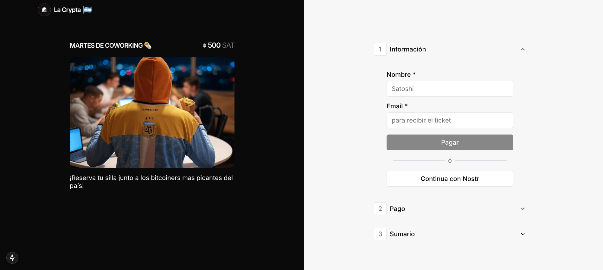

# llamout

An open source payment system built with Next and focused on Bitcoin.

[](https://llamout.vercel.app/)


## 🤓 Tech Stack

- Framework: [Next.js](https://nextjs.org/)
- Database: [Instantdb](https://www.instantdb.com/)
- Payments: [Lightning Network](https://lightning.network/)
- UI Library: [Shadcn/ui](https://ui.shadcn.com/)

## ✏️ Roadmap

### Core Features

- [x] Database on Instantdb
- [x] Lightning Payments via [LUD-16](https://github.com/lnurl/luds/blob/luds/16.md)
- [x] Tiny [/dashboard](https://llamout.vercel.app/dashboard)

### Soon
- [ ] Email sending system with [React Email](https://react.email/) and [Resend](https://resend.com/)
- [ ] Validation with Zod
- [ ] Customize Checkout
- [ ] Onboarding Process
- [ ] Authentication with Instantdb or Nostr
- [ ] Roles System


## 🚀 Running Locally

1. Clone the repository
``` bash
git clone ...
```

2. Install dependencies using pnpm
``` bash
pnpm install
```

3. Copy the `.env.example` to `.env` and update the variables.
``` bash
cp .env.example .env
```

4. Start the development server
``` bash
pnpm run dev
```

## 🤝 Contribute

We'd love to hear from you to improve **Llamout**! Follow these steps to contribute:

1. Fork the repository.
2. Create a branch with your changes:
   ```bash
   git checkout -b feature/my-new-feature
   ```
3. Make your changes and commit:
   ```bash
   git commit -m 'Adds a new functionality'
   ```
4. Push your changes to your fork:
   ```bash
   git push origin feature/my-new-feature
   ```
5. Create a Pull Request detailing your improvements.

## 🩷 Donations

If you'd like to support the development of **Llamout**, please consider donating to the developer.

- ⚡ Zap sats to [dios@lawallet.ar](dios@lawallet.ar)

## 💌 Contact

If you have any questions or concerns about **Llamout**, please contact the developer at [npub1em3g0wcfjz5we0gaaelw07fcyqys3fwg42qykw774mvgala424rsl26ytm](https://njump.me/npub1em3g0wcfjz5we0gaaelw07fcyqys3fwg42qykw774mvgala424rsl26ytm).